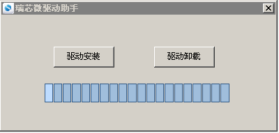
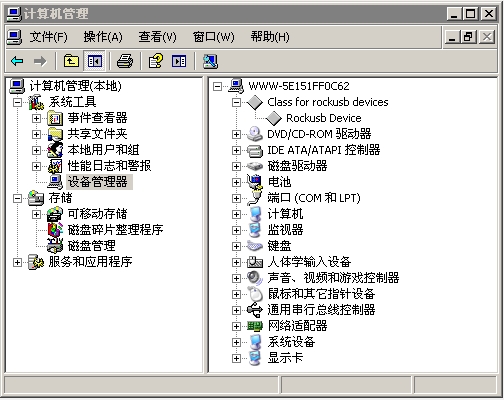
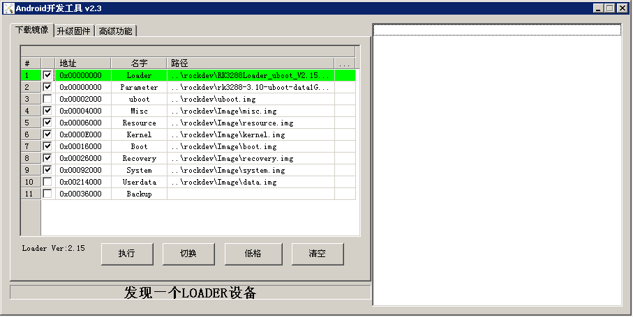
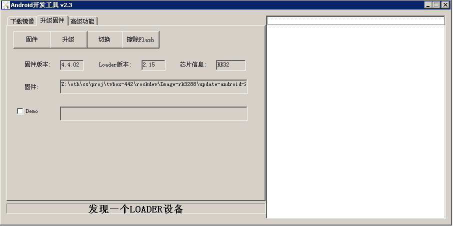
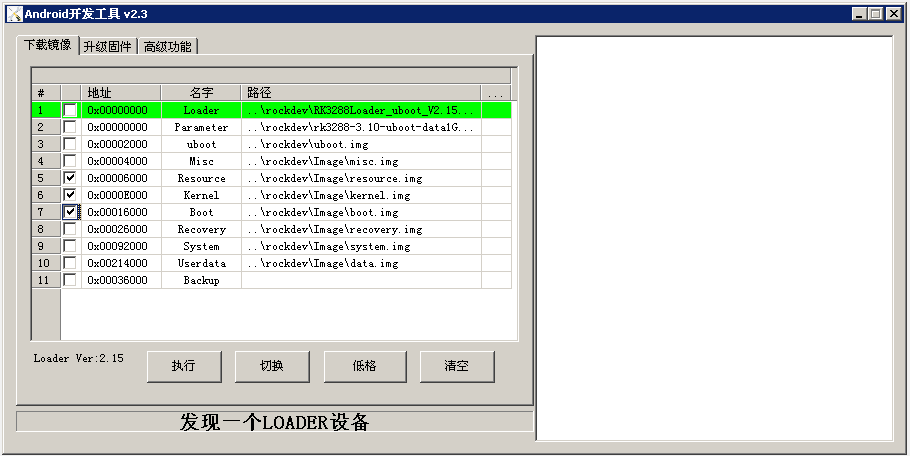
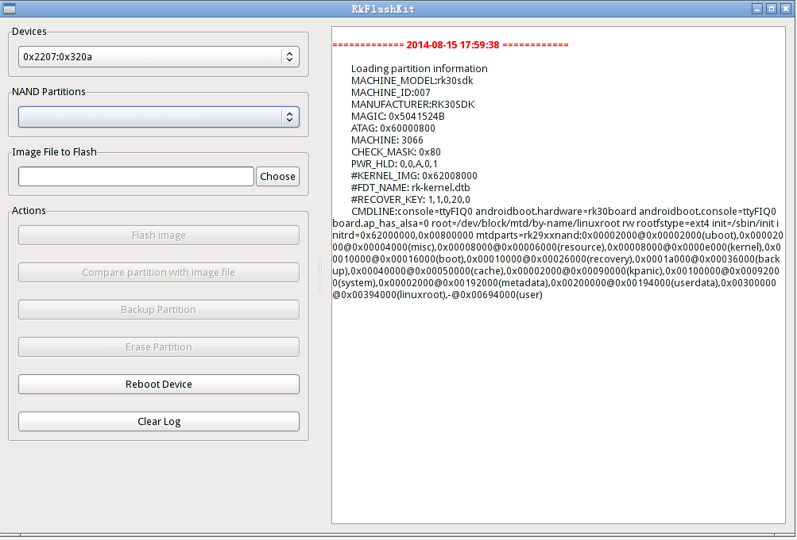

## 介绍


pcDuino9是一个高性能平台，拥有强大的多线程运算能力、图形处理能力以及硬件解码能力，而且它支持 Android和 Ubuntu 双系统，所以它也是一台强大的小型电脑， 我们希望你的创意和灵感能让它变得不平凡。

## 规范

* CPU : Rockchip RK3288 ARM Corte-A17 Quad-Core up to 1.8GHz
* GPU : ARM Mali-T760 MP4 Support OpenGL ES 1.1/2.0 /3.0, OpenVG1.1, OpenCL1.1, Directx11
* Memory : 1GB-4GB Dual-channel 32-bit LPDDR3
* Storage : 8GB-16GB eMMC (Opt.), Micro SD slot support SDXC
* Ethernet : 10/100/1000Mbps Ethernet (RTL8211)
* USB : USB 2.0 Host x 2 (Opt.), USB OTG x 1
* Video : HDMI2.0 support maximum 4K@60Hz display (Micro HDMI), LVDS/MIPI-DSI display interface
* Audio : 3.5mm audio In/Out
* Camera : MIPI-CSI camera interface
* WiFi/BT : AP6212 WiFi + BT module
* GPIO Extension : Raspberry Pi compatible GPIO, support UART, SPI, I2C BMC extension GPIO (Opt.), support ADC, PWM, UART, I2C
* Board Size : 96 x 76 mm

## 产品参数

* CPU: Rockchip RK3288 ARM Corte-A17 Quad-Core up to 1.8GHz
* GPU: ARM Mali-T760 MP4 Support OpenGL ES 1.1/2.0 /3.0, OpenVG1.1, OpenCL1.1, Directx11
* 内存: 2GB DDR3 双通道
* 存储器 : 16GB eMMC Flash, Micro SD 
* 网络 ：以太网 -10/100/1000M以太网，无线网 -2.4GHz/5GHz双频WiFi，支持802.11a/b/g/n/ac协议，蓝牙 -Bluetooth 4.0
* 视频输入输出：HDMI2.0 up to 3840x2160@60O ,VGA up to 1080P
* USB : USB2.0 x 1
* IR : 支持红外遥控功能
* 电源 ： DC -5V/2.5A

## GPIOs 映射

* pcDuino9  


|Pin Num|  Name    |Linux GPIO|Pin Num|  Name    |Linux GPIO|
| ----- |: ------ :|: ------ :|: --- :|: ------ :| --------:|
| 1     | 3.3V     |          | 2     |  VDD5V   |          |
| 3     | I2C4_SDA |          | 4     |  VDD5V   |          |
| 5     | I2C4_SCL |          | 6     |  GND     |          |
| 7     | GPIO_0   |   56     | 8     | UART2_TX |          |
| 9     | GND      |          | 10    | UART2_RX |          |
| 11    | GPIO_1   |   57     | 12    | GPIO_8   | 63       |
| 13    | GPIO_2   |   58     | 14    | GND      |          |
| 15    | GPIO_3   |   59     | 16    | GPIO_9   | 64       |
| 17    | 3.3V     |          | 18    | GPIO_10  | 65       |
| 19    |SPI0_MOSI |          | 20    | GND      |          |
| 21    |SPI0_MISO |          | 22    | GPIO_11  | 66       |
| 23    |SPI0_SCLK |          | 24    | SPI0_CS0 |          |
| 25    | GND      |          | 26    | SPI0_CS1 |          |
| 27    | I2C3_SDA |          | 28    | I2C3_SCL |          |
| 29    | GPIO_4   |   60     | 30    | GND      |          |
| 31    | GPIO_5   |   61     | 32    | GPIO_12  | 68       |
| 33    | GPIO_6   |   62     | 34    | GND      |          |
| 35    | UART3_CTS|          | 36    | UART2_TX |          |
| 37    | GPIO_7   |   225    | 38    | UART2_RX |          |
| 39    | GND      |          | 40    | UART2_RTS|          |

* BMC STM32F411   


|Pin Num|  Name    |STM32 GPIO|Pin Num|  Name    |STM32 GPIO|
| ----- |: ------ :|: ------ :|: --- :|: ------ :| --------:|
| 41    | PWM2_CH1 | PA0      | 42    | PWM3_CH1 |  PA8     |
| 43    | PWM2_CH2 | PA1      | 44    | PWM3_CH4 |  PA11    |
| 45    | PWM2_CH3 | PA2      | 46    | IN9_EXT  |  PB1     |
| 47    | PWM2_CH4 | PA3      | 48    | SLOT_ID0 |  PB9     |
| 49    | BMC_SDA  | PB12     | 50    | SLOT_ID1 |  PB13    |
| 51    | BMC_SCL  | PB10     | 52    | SLOT_ID2 |  PB14    |
| 53    | VDD3.3V  |          | 54    | SLOT_ID3 |  PB15    |
| 55    | GND      |          | 56    | GND      |          |

## 快速入门

#### 1.在Windows烧写系统到eMMC

##### a.安装 RK USB 驱动

* 下载 [DriverAssistant](https://github.com/delongqilinksprite/pcDuino9-user-manual.git),解压，然后运行里面的DriverInstallexe。

* 为了使所有设备都是用更新的驱动，请选择“驱动卸载”，然后在选择“驱动安装”。



###### 连接设备

* 1.确保设备连接好电源适配器并处于通电状态。

* 2.用 Micro USB OTG 线连接好设备和主机。

* 3.按住设备上的 RECOVERY （恢复）键并保持。

* 4.短按一下 RRESET（复位）键。

* 5.大约两秒钟后，松开 RECOVERY 键。

* 6.注意：如果发现按了 RESET 键后还是没有发现设备，请在保持 RECOVERY 键按下的同时，长按一下 PWRKEY 键，然后才松开 RECOVERY 键。

主机应该会提示发现新硬件并配置驱动。打开设备管理器，会见到新设备"Rockusb Device" 出现，如下图。如果没有，则需要返回上一步重新安装驱动。




##### b.烧写固件

下载[AndroidTool](https://github.com/delongqilinksprite/pcDuino9-user-manual.git),解压，运行里面的AndroidTool.exe(注意，如果是Windows7/8，需要按鼠标右键，选择以管理员身份运行)，如下图：



###### 烧写统一固件 xxxx.img 的步骤如下：


* 1.切换至"升级固件"页。

* 2.按"固件"按钮，打开要升级的固件文件。升级工具会显示详细的固件信息。

* 3.按"升级"按钮开始升级。

* 如果升级失败，可以尝试先按"擦除Flash"按钮来擦除 Flash，然后再升级。


###### 注意：如果你烧写的固件laoder版本与原来的机器的不一致，请在升级固件前先执行"擦除Flash"。



###### 烧写分区映像

烧写分区映像时，请使用对应SDK下的FFTools/AndroidTool.rar烧写。步骤如下：


* 1.切换至"下载镜像"页。
* 2.勾选需要烧录的分区，可以多选。
* 3.确保映像文件的路径正确，需要的话，点路径右边的空白表格单元格来重新选择。
* 4.点击"执行"按钮开始升级，升级结束后设备会自动重启。



#### 2.在Linux烧写系统到eMMC

RK 提供了一个 Linux 下的命令行工具 upgrade_tool，支持统一固件 update.img 和分区镜像的烧写。

开源工具则有两个选择:

* rkflashtool https://github.com/Galland/rkflashtool_rk3066

* rkflashkit https://github.com/linuxerwang/rkflashkit

它们都仅支持分区映像烧写，不支持统一固件。rkflashtool 是命令行工具，rkflashkit 有图形界面，后加了命令行支持，更是好用。以下仅对 rkflashkit 做介绍。
Linux 下无须安装设备驱动，参照 Windows 章节连接设备则可。

###### upgrade_tool

下载 [Linux_Upgrade_Tool](https://github.com/delongqilinksprite/pcDuino9-user-manual.git), 并按以下方法安装到系统中，方便调用：


```
tar xf Linux_UpgradeTool_v1.2.tar.gz

cd Linux_UpgradeTool_v1.2

sudo mv upgrade_tool /usr/local/bin

sudo chown root:root /usr/local/bin/upgrade_tool
```

烧写统一固件 uxxxx.img：

```
sudo upgrade_tool uf update.img
```

烧写分区镜像：


```
sudo upgrade_tool di -b /path/to/boot.img

sudo upgrade_tool di -k /path/to/kernel.img

sudo upgrade_tool di -s /path/to/system.img

sudo upgrade_tool di -r /path/to/recovery.img

sudo upgrade_tool di -m /path/to/misc.img

sudo upgrade_tool di resource /path/to/resource.img

sudo upgrade_tool di -p paramater   #烧写 parameter

sudo upgrade_tool ul bootloader.bin # 烧写 bootloader
```

如果因 flash 问题导致升级时出错，可以尝试低级格式化、擦除 nand flash：


```
sudo upgrade_tool lf   # 低级格式化

sudo upgrade_tool ef   # 擦除
```

###### rkflashkit

安装：


```
 sudo apt-get install build-essential fakeroot 

 git clone https://github.com/linuxerwang/rkflashkit

 cd rkflashkit

 ./waf debian

 sudo apt-get install python-gtk2

 sudo dpkg -i rkflashkit_0.1.2_all.deb
```

图形界面：

```
sudo rkflashkit
```




命令行:


```
$ rkflashkit --help

Usage: <cmd> [args] [<cmd> [args]...]


part                              List partition

flash @<PARTITION> <IMAGE FILE>   Flash partition with image file

cmp @<PARTITION> <IMAGE FILE>     Compare partition with image file

backup @<PARTITION> <IMAGE FILE>  Backup partition to image file

erase  @<PARTITION>               Erase partition

reboot                            Reboot device

For example, flash device with boot.img and kernel.img, then reboot:

sudo rkflashkit flash @boot boot.img @kernel.img kernel.img reboot
```

#### 3.SD卡启动系统

* 下载xxxx.img系统镜像

* 准备一张内存卡（4GB以上C10）

* 使用dd命令将系统复制到SD

* 将卡插在pcDuino9，开机需要按着MASKROM键从TF卡启动


#### 4.pcDuino9硬件操作

硬件操作基于NightWiring

现在它是一个跨平台的C++库控制的硬件接口，包括UART、I2C、SPI和GPIO。大部分的代码是从wiringpi。

GPIO的功能是基于sysfs的现在，这是稍微慢一点，但灵活。


* git clone https://github.com/nightseas/nightWiring.git


```
cd nightWiring/

make -j4

sudo make install
```

##### GPIO LED控制

```
#include "nightWiring.h"

#include "nightWiringGPIO.h"

#include "stdio.h"

static int fennecGpioMap[] = {

    /*  GPIO2_A0  */
            56,
    /*  GPIO2_A1,       GPIO2_A2,       GPIO2_A3,       GPIO2_A4    */
            57,             58,             59,             60,
    /*  GPIO2_A5,       GPIO2_A6,       GPIO7_B1,       GPIO2_A7    */
            61,             62,             225,            63,
    /*  GPIO2_B0,        GPIO2_B1,      GPIO2_B2,       GPIO2_B4    */
            64,             65,             66,             68,
    /*  GPIO2_B5,        GPIO7_B0,      GPIO7_A7,       GPIO7_B2    */
            69,             224,            223,            226
};

int ledMap[] = {2, 10, 3, 11};

int main(void)
{
    int i, j;
    nightWiringSetup();
    nightWiringGpioSetup(fennecGpioMap, 17);
    for(i=0; i<4; i++)
        pinMode(ledMap[i], OUTPUT);
    while(1)
    {
        for(i=0; i<4; i++)
        {
            for(j=0; j<4; j++)
                digitalWrite(ledMap[j], HIGH);
            digitalWrite(ledMap[i], LOW);
            delay(500);
        }
    }
    return 0;
}

``` 

##### GPIO 按键输入


```
#include "nightWiring.h"
#include "nightWiringGPIO.h"
#include "stdio.h"

static int fennecGpioMap[] = {
    /*  GPIO2_A0  */
            56,
    /*  GPIO2_A1,       GPIO2_A2,       GPIO2_A3,       GPIO2_A4    */
            57,             58,             59,             60,
    /*  GPIO2_A5,       GPIO2_A6,       GPIO7_B1,       GPIO2_A7    */
            61,             62,             225,            63,
    /*  GPIO2_B0,        GPIO2_B1,      GPIO2_B2,       GPIO2_B4    */
            64,             65,             66,             68,
    /*  GPIO2_B5,        GPIO7_B0,      GPIO7_A7,       GPIO7_B2    */
            69,             224,            223,            226
};

int keyMap[] = {6, 13, 4, 12, 5};
char keyName[5][7] = {"UP\0", "CENTER\0", "DOWN\0", "LEFT\0", "RIGHT\0"};     

int readKey(int num)
{
    int key = digitalRead(keyMap[num]);
    if(key == LOW)
    {
        // Delay for a while and re-detect the key status
        // Filtering glitches on the signal
        delay(10);
        if(key == LOW)
            return 1;
    }

    return 0;
}

int main(void)
{
    int i;
    nightWiringSetup();
    nightWiringGpioSetup(fennecGpioMap, 17);
    for(i=0; i<5; i++)
        pinMode(keyMap[i], INPUT);
    while(1)
    {
        for(i=0; i<5; i++)
        {
            if(readKey(i))
            {
                printf("Key %s is pressed!\n", keyName[i]);
                delay(500);
            }          
        }
    }
    return 0;
}
```


#### I2C RTC

```
#include "nightWiring.h"

#include "nightWiringI2C.h"

#include "stdio.h"

#define DS1307_ADDR 0x68

int i2cFd;
int quitFlag = 0;

unsigned char DEC2BCD(unsigned char val)
{
   return ( (val/10*16) + (val%10) );

}

unsigned char BCD2DEC(unsigned char val)
{
   return ( (val/16*10) + (val%16) );
}


void rtcSetTime(unsigned char year, unsigned char month, unsigned char date, unsigned char dayofWeek, unsigned char hour, unsigned char min ,unsigned char sec)
{
  unsigned char reg = 0x00;
  i2cWriteReg8(i2cFd, 0x00, DEC2BCD(sec));
  i2cWriteReg8(i2cFd, 0x01, DEC2BCD(min));
  i2cWriteReg8(i2cFd, 0x02, DEC2BCD(hour));
  i2cWriteReg8(i2cFd, 0x03, DEC2BCD(dayofWeek));
  i2cWriteReg8(i2cFd, 0x04, DEC2BCD(date));
  i2cWriteReg8(i2cFd, 0x05, DEC2BCD(month));
  i2cWriteReg8(i2cFd, 0x06, DEC2BCD(year));   
}

void rtcGetTime() 
{
  unsigned char year, month, date, dayofWeek, hour, min ,sec;
  unsigned char reg = 0x00;
  sec       = BCD2DEC(i2cReadReg8(i2cFd, 0x00) & 0x7f);
  min       = BCD2DEC(i2cReadReg8(i2cFd, 0x01));
  hour      = BCD2DEC(i2cReadReg8(i2cFd, 0x02) & 0x3f);
  dayofWeek = BCD2DEC(i2cReadReg8(i2cFd, 0x03));
  date      = BCD2DEC(i2cReadReg8(i2cFd, 0x04));
  month     = BCD2DEC(i2cReadReg8(i2cFd, 0x05));
  year      = BCD2DEC(i2cReadReg8(i2cFd, 0x06));
  printf("Time: %02d-%02d-%02d  %02d:%02d:%02d.\n", year, month, date, hour, min ,sec);
}

int main(void)
{
    int i;
    if((i2cFd=i2cSetup("/dev/i2c-4", DS1307_ADDR)) < 0)
    {
        printf("Error: I2C acess failed! i2cSetup() return %d\n",i2cFd);
        return 0;
    }
    printf("I2C interface init complete.\n");
    printf("Writing time 2016-10-01 Sat 21:10:00 to RTC...\n");
    rtcSetTime(16,10,1,6,21,10,0);
    while(1)
    {
        rtcGetTime();
        delay(1000);
    }
    return 0;
}
```


###### 更多例程见nightWiring/example
